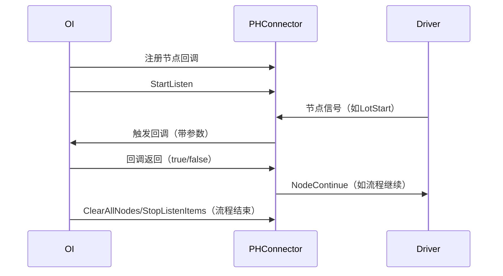

# PH Connector 使用文档

## 1. 用户可调用的 API 及使用说明

### 主要类

#### PHConnector

```csharp
public class PHConnector : IDisposable
```
- **说明**：OI 与 Prober/Handler Driver 间的共享内存通信与节点控制主入口，支持节点注册、监听、卡控、测试模式切换等。

---

#### 构造函数

```csharp
public PHConnector(ILogger logger)
```
- **参数**：`logger` —— 日志对象，需实现 `ILogger` 接口。
- **说明**：创建连接器实例，初始化共享内存和日志。

---

#### 设置测试模式

```csharp
public PHConnector SetTestMode(TestMode testMode)
```
- **参数**：`testMode` —— 测试模式（枚举：Normal、ManualWithoutPH、ManualWithPH）
- **返回值**：自身实例
- **说明**：设置当前测试模式。

---

#### 执行一次点测

```csharp
public bool ExecuteSingleTest()
```
- **参数**：无
- **返回值**：是否成功
- **说明**：设置点测标志位，驱动执行一次点测。

---

#### 清除点测标志位

```csharp
public bool ClearSingleTestFlag()
```
- **参数**：无
- **返回值**：是否成功
- **说明**：清除点测标志位。

---

#### 设置 FullSites 信息

```csharp
public void SetFullSite(List<int> fullSiteInfo)
```
- **参数**：`fullSiteInfo` —— 需要开启的 site 位置列表（如 [1,2,5,7,8]）
- **返回值**：无
- **说明**：设置 FullSites 信息到共享内存。

---

#### 开始监听节点

```csharp
public bool StartListen()
```
- **参数**：无
- **返回值**：监听是否开启成功
- **说明**：启动后台线程，监听节点状态变化。

---

#### 停止监听节点

```csharp
public void StopListenItems()
```
- **参数**：无
- **返回值**：无
- **说明**：停止监听并清除所有节点。

---

#### 清除所有节点

```csharp
public PHConnector ClearAllNodes()
```
- **参数**：无
- **返回值**：自身实例
- **说明**：清除所有节点的挂起与注册回调。

---

#### 节点继续（解除挂起）

```csharp
public void NodeContinue(Node listenItem)
```
- **参数**：`listenItem` —— 节点类型（枚举：LotStart、LotEnd、WaferStart、WaferEnd、TestStart、TestEnd）
- **返回值**：无
- **说明**：解除指定节点的挂起状态。

---

#### 注册节点回调

```csharp
public PHConnector RegisterLotStart(Func<CallBackParameter, bool> func)
public PHConnector RegisterLotEnd(Func<CallBackParameter, bool> func)
public PHConnector RegisterWaferStart(Func<CallBackParameter, bool> func)
public PHConnector RegisterWaferEnd(Func<CallBackParameter, bool> func)
public PHConnector RegisterTestStart(Func<CallBackParameter, bool> func)
public PHConnector RegisterTestEnd(Func<CallBackParameter, bool> func)
```
- **参数**：`func` —— 回调函数，参数为节点回调参数，返回值为是否继续流程
- **返回值**：自身实例
- **说明**：注册各节点的回调函数，节点到达时自动触发。

---

#### 注销节点回调

```csharp
public PHConnector UnRegisterLotStart()
public PHConnector UnRegisterLotEnd()
public PHConnector UnRegisterWaferStart()
public PHConnector UnRegisterWaferEnd()
public PHConnector UnRegisterTestStart()
public PHConnector UnRegisterTestEnd()
```
- **参数**：无
- **返回值**：自身实例
- **说明**：注销对应节点的回调。

---

#### 资源释放

```csharp
public void Dispose()
```
- **参数**：无
- **返回值**：无
- **说明**：释放所有资源，停止监听。

---

### 关键类型

#### TestMode

```csharp
public enum TestMode
{
    Normal,
    ManualWithoutPH,
    ManualWithPH
}
```
- **说明**：测试模式枚举。

---

#### Node

```csharp
public enum Node
{
    LotStart,
    LotEnd,
    WaferStart,
    WaferEnd,
    TestStart,
    TestEnd
}
```
- **说明**：节点类型枚举。

---

#### CallBackParameter

```csharp
public class CallBackParameter
{
    public string LotNo { get; set; }
    public string DeviceName { get; set; }
    public string WaferNo { get; set; }
    public string Temperature { get; set; }
    public string GetAllProperties();
}
```
- **说明**：节点回调参数，包含批次号、设备名、片号、温度等。

---

## 2. 使用样例

```csharp
using Sandtek.OI.PHConnector;
using Sandtek.OI.Com.Logger;

public class ApplicationClass
{
    private ILogger _logger;
    private PHConnector _phConnector;

    public ApplicationClass()
    {
        _logger = new LoggerBuilder();
        _phConnector = new PHConnector(_logger);
        _phConnector.SetTestMode(TestMode.Normal);
    }

    public void AfterLoad()
    {
        // 注册开批节点回调
        _phConnector.RegisterLotStart(callBackParameter =>
        {
            _logger?.Info("LotStart triggered");
            string expectedLotNumber = "lotNumber";
            if (callBackParameter.LotNo != expectedLotNumber)
            {
                _logger?.Error($"Lot number mismatch, expected:{expectedLotNumber}, Actual:{callBackParameter.LotNo}");
                _phConnector.ClearAllNodes();
                return false;
            }
            return true;
        });

        // 注册结批节点回调
        _phConnector.RegisterLotEnd(x =>
        {
            _logger?.Info("LotEnd triggered");
            // 结束测试
            // StopCommand();
            _phConnector.ClearAllNodes();
            return true;
        });

        // 启动监听
        _logger?.Info("Start listening connector nodes");
        _phConnector.StartListen();
    }

    public void AfterLotEnd()
    {
        // 测试结束后清理
        _phConnector.ClearAllNodes();
        _phConnector.StopListenItems();
        _logger?.Info("Clear connector nodes and stop listening");
    }
}
```

### 关键说明

- **注册节点回调**：通过 `RegisterLotStart`、`RegisterLotEnd` 等方法注册节点到达时的处理逻辑。
- **回调参数**：`CallBackParameter` 提供当前节点相关的 LotNo、DeviceName、WaferNo、Temperature 等信息。
- **流程控制**：回调返回 `true` 表示流程继续，`false` 表示流程暂停或中断。
- **监听与清理**：`StartListen` 启动监听，`ClearAllNodes`/`StopListenItems` 用于流程结束后的清理。

---

## 3. 交互流程



