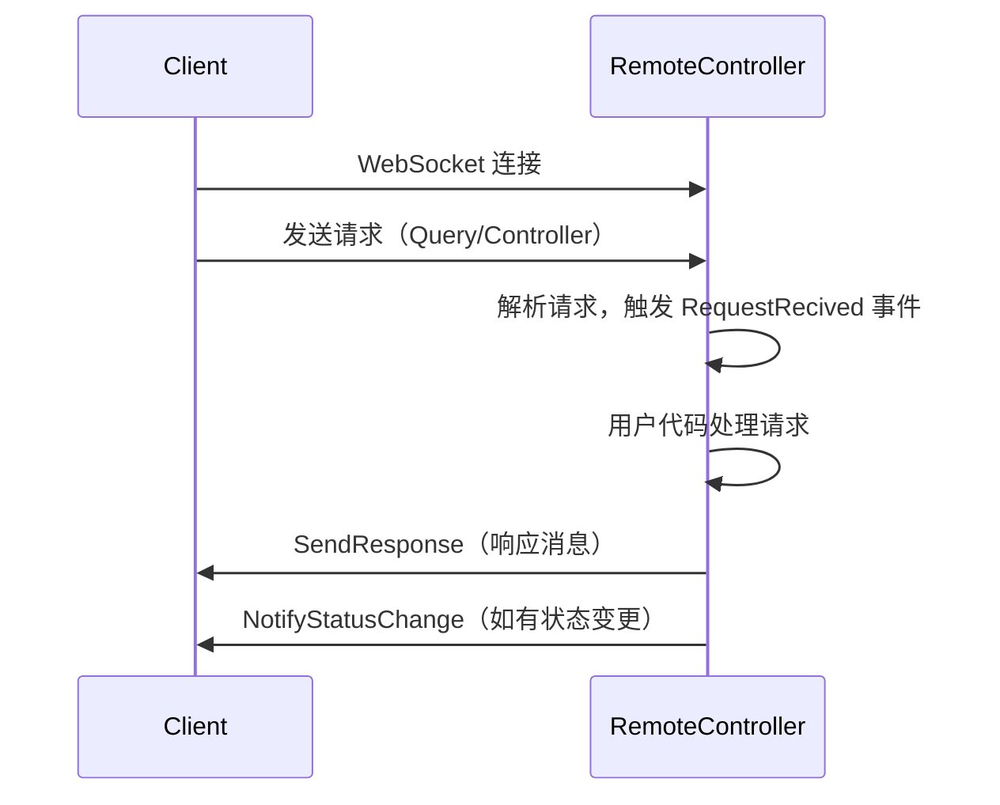

# RemoteController 使用文档

## 1. 用户可调用的 API 及使用说明

### 主要接口与类

#### IRemoteController 接口

```csharp
public interface IRemoteController : IDisposable
{
    event EventHandler<ResolveResult> RequestRecived;
    Task NotifyStatusChange(StatusResponse status);
    void StartListen();
    void SendResponse(Response response, string token);
}
```
- **说明**：远程控制器的标准接口，支持事件驱动的消息处理、状态通知、响应发送和监听启动。

---

#### 事件

##### 请求接收事件

```csharp
event EventHandler<ResolveResult> RequestRecived
```
- **参数**：事件参数为 `ResolveResult`，包含请求类型、命令、token、参数字典。
- **说明**：当接收到客户端请求时触发。你可以通过订阅此事件来处理所有来自客户端的消息。

---

#### 方法

##### 通知客户端 OS 状态更新

```csharp
Task NotifyStatusChange(StatusResponse status)
```
- **参数**：`status` —— 状态响应对象（`StatusResponse`），用于描述当前 OI 状态。
- **返回值**：`Task`，异步操作。
- **说明**：通知所有已连接客户端 OI 状态发生变化。通常用于广播状态变更。

---

##### 启动监听

```csharp
void StartListen()
```
- **参数**：无
- **返回值**：无
- **说明**：启动 WebSocket 服务器，开始监听客户端消息。必须调用此方法后，服务端才能接收客户端连接和消息。

---

##### 发送响应到客户端

```csharp
void SendResponse(Response response, string token)
```
- **参数**：  
  - `response` —— 响应对象（`Response`），需序列化为 JSON 发送给客户端。  
  - `token` —— 客户端标识（string），用于指定响应目标客户端。
- **返回值**：无
- **说明**：向指定 token 的客户端发送响应消息。通常在处理完客户端请求后调用。

---

##### 释放资源

```csharp
void Dispose()
```
- **参数**：无
- **返回值**：无
- **说明**：释放所有资源，关闭所有客户端连接。建议使用 `using` 语句或手动调用。

---

### 关键数据类型

#### ResolveResult

```csharp
public class ResolveResult
{
    public RequestType Type { get; set; }
    public int Order { get; set; }
    public string Token { get; set; }
    public Dictionary<string, string> Parameters { get; set; }

    public ResolveResult(RequestType type, int order, string token, Dictionary<string,string> parameters)
}
```
- **Type**：请求类型（`RequestType` 枚举，Query/Controller）
- **Order**：请求命令（int，具体含义依赖于请求类型）
- **Token**：客户端标识
- **Parameters**：请求体参数字典

---

#### RequestType

```csharp
public enum RequestType
{
    Query = 0,
    Controller = 1
}
```
- **Query**：查询请求
- **Controller**：控制指令请求

---

#### StatusResponse、Response

- `StatusResponse`、`Response` 类型分别代表状态变更响应和通用响应，需根据实际业务实现和序列化为 JSON 发送。

---

## 2. 使用样例

```csharp
using Sandtek.OI.RemoteController;
using Sandtek.OI.RemoteController.Data.Responses.Impl;
using Sandtek.OI.RemoteController.Data.Responses;
using Sandtek.OI.Com.Logger;

class Program
{
    static void Main()
    {
        // 1. 创建日志对象（需实现 ILogger 接口）
        ILogger logger = new ConsoleLogger();

        // 2. 创建远程控制器实例
        using (IRemoteController controller = new RemoteController(logger))
        {
            // 3. 订阅请求事件
            controller.RequestRecived += (sender, e) =>
            {
                // e 为 ResolveResult，包含请求类型、命令、token、参数字典
                if (e.Type == RequestType.Query)
                {
                    // 处理查询请求
                    // e.Order 可映射为 QueryInfo 枚举
                }
                else if (e.Type == RequestType.Controller)
                {
                    // 处理控制指令
                    // e.Order 可映射为 ControllerCommand 枚举
                }

                // 4. 发送响应
                var response = new StatusResponse { /* 填充响应内容 */ };
                controller.SendResponse(response, e.Token);
            };

            // 5. 启动监听
            controller.StartListen();

            // 6. 主线程保持运行
            Console.WriteLine("RemoteController started. Press Enter to exit.");
            Console.ReadLine();
        }
    }
}
```

### 关键说明

- **ILogger**：需实现日志接口，便于调试和运行时日志输出。
- **RequestRecived 事件**：每当有客户端请求到达时触发，事件参数 `ResolveResult` 提供了请求类型、命令、token 和参数字典。
- **SendResponse**：通过 token 精确响应到对应客户端。
- **StartListen**：必须调用，启动 WebSocket 服务监听。
- **Dispose**：建议用 `using` 或手动调用，确保资源释放。

---

## 3. 交互流程



