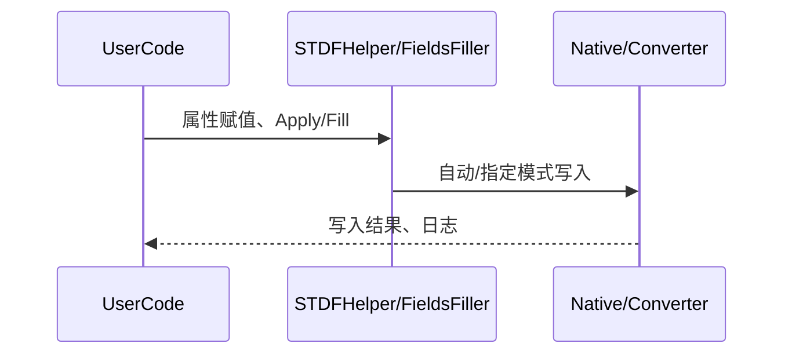

# STDF 使用文档

## 1. 用户可调用的 API 及使用说明

### 1.1 推荐主入口：STDFHelper

#### STDF 内容写入帮助类

```csharp
public class STDFHelper
```
- **说明**：推荐的 STDF 字段写入与配置主入口，支持自动模式切换（Native/Converter），通过属性赋值和 Apply 方法实现 STDF 字段的批量写入。

---

#### 配置 STDFHelper 行为

```csharp
public STDFHelper Configure(Action<BuilderOption> configure)
```
- **参数**：`configure` —— 配置选项的委托，可用于指定写入模式、配置文件路径等。
- **返回值**：自身实例
- **说明**：可链式调用，用于自定义 STDF 写入行为（如强制使用 Native/Converter、指定 config 路径等）。

---

#### 应用属性到 STDF（推荐主用）

```csharp
public void Apply()
```
- **参数**：无
- **返回值**：无
- **说明**：将当前对象的属性值批量写入 STDF（自动判断使用 Native 还是 Converter 模式，或根据配置决定）。

---

#### 测试/高级用法：自定义模式与目标

```csharp
public void Apply(ISTDFModeProvider modeProvider, IVersionInfo fileVersion, ILotSettingConfig lotSettingConfig)
```
- **参数**：
  - `modeProvider` —— STDF 模式提供器（可 mock）
  - `fileVersion` —— 版本信息
  - `lotSettingConfig` —— 目标配置对象
- **返回值**：无
- **说明**：用于测试或特殊场景，手动指定模式、目标等。

---

#### 属性赋值

- 只需将 STDFHelper 的公开属性（如 LOT_ID、SBLOT_ID、PART_TYP 等）赋值即可，属性名与 STDF 字段一一对应。

---

### 1.2 进阶用法：自定义填充器链

#### 构建字段填充器

```csharp
var builder = FieldsFiller.CreateBuilder(ILogger logger);
```
- **参数**：日志对象
- **返回值**：FieldFillerBuilder 实例
- **说明**：用于自定义填充器链（如只用 Native、只用 Converter、或二者组合）。

---

#### 添加 STDF 填充器（自动/指定模式）

```csharp
builder.AddSTDF(Action<BuilderOption> optionConfigure = null)
```
- **参数**：可选配置委托
- **返回值**：自身实例
- **说明**：根据配置自动选择 Native/Converter/二者组合。

---

#### 添加 Native 填充器

```csharp
builder.AddNativeOSAPIFiller()
```
- **参数**：无
- **返回值**：自身实例
- **说明**：强制使用 Native OS API 方式写入 STDF 字段。

---

#### 添加 Converter 填充器

```csharp
builder.AddSTDFConverterConfigFiller(string configFilePath = null)
```
- **参数**：可选 config 文件路径
- **返回值**：自身实例
- **说明**：强制使用 STDF Converter config 文件方式写入。

---

#### 构建并填充

```csharp
var filler = builder.Build();
filler.Fill(object config);
```
- **参数**：config —— 带有 STDF 属性标记的对象
- **返回值**：bool（是否成功）
- **说明**：将对象属性批量写入 STDF。

---

### 1.3 属性标记

#### 标记 STDF 字段

```csharp
[STDF(STDFFieldName.LOT_ID)]
public string LotNo { get; set; }
```
- **说明**：在自定义配置类属性上标记 STDF 字段名，支持自动映射。

---

### 1.4 关键类型说明

#### BuilderOption

- 用于配置写入模式、config 路径等。
- 典型方法：
  - `ChangeConfigFilePath(string path)`：指定 config 路径
  - `EnableIntelligentMode()` / `DisableIntelligentMode()`：启用/禁用自动模式选择

#### STDFFieldName

- 枚举，包含所有支持的 STDF 字段名（如 LOT_ID、PART_TYP、NODE_NAM 等）

#### STDFMode

- 枚举，支持 Converter、Native、ConverterAndNative、None

---

## 2. 完整使用样例

### 2.1 推荐用法：自动模式写入

```csharp
using Sandtek.OI.STDF.Simple;
using Sandtek.OI.Com.Logger;

class MyConfig : STDFHelper
{
    public MyConfig(ILogger logger) : base(logger) { }

    // 标记 STDF 字段
    [STDF(STDFFieldName.LOT_ID)]
    public string LotNo { get; set; }

    [STDF(STDFFieldName.SBLOT_ID)]
    public string SubLotNo { get; set; }
}

class Program
{
    static void Main()
    {
        ILogger logger = new ConsoleLogger();

        // 1. 创建配置对象并赋值
        var config = new MyConfig(logger)
        {
            LotNo = "lotno123",
            SubLotNo = "sublot456"
        };

        // 2. 可选：自定义写入行为（如指定 config 路径、强制模式等）
        config.Configure(opt =>
        {
            // opt.ChangeConfigFilePath("your_path/config.ini");
            // opt.DisableIntelligentMode();
        });

        // 3. 写入 STDF
        config.Apply();

        // 4. 日志输出、异常处理等
    }
}
```

#### 关键注释说明

- **属性标记**：用 `[STDF(STDFFieldName.XXX)]` 标记属性，自动映射 STDF 字段。
- **Configure**：可选，链式配置写入行为。
- **Apply**：核心方法，自动判断并写入 STDF。
- **ILogger**：日志对象，便于调试和追踪。

---

### 2.2 进阶用法：自定义填充器链

```csharp
using Sandtek.OI.Com.Configure;
using Sandtek.OI.Com.Logger;
using Sandtek.OI.STDF.Fillers.Builders;

class MyConfig
{
    [STDF(STDFFieldName.LOT_ID)]
    public string LotNo { get; set; }
    [STDF(STDFFieldName.SBLOT_ID)]
    public string SubLotNo { get; set; }
}

class Program
{
    static void Main()
    {
        ILogger logger = new ConsoleLogger();
        var config = new MyConfig { LotNo = "lotno", SubLotNo = "sublot" };

        var builder = FieldsFiller.CreateBuilder(logger)
            .AddSTDFConverterConfigFiller(); // 只用 Converter

        var filler = builder.Build();
        filler.Fill(config);
    }
}
```

---

## 3. 典型交互流程



---

## 4. 其他说明

- **自动模式**：默认根据环境自动选择 Native/Converter，无需手动干预。
- **可扩展性**：支持自定义填充器链，适配不同业务场景。
- **属性丰富**：支持绝大多数 STDF 字段，详见 `STDFFieldName` 枚举。
- **兼容性**：推荐使用 `STDFHelper`，部分旧 API 已标记为过时。

---

如需更详细的类型定义或扩展用法，请参考源码中 `Simple/`, `Fillers/Builders/`, `NativeSTDFFiller/` 等相关实现。